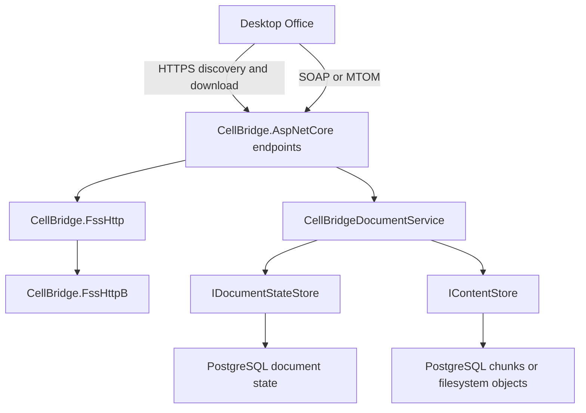

# Architecture

CellBridge implements the Office file synchronization protocols in reusable
.NET libraries. The sample host and demo provide a development environment;
[interoperability coverage](interoperability.md) describes the tested client
behavior and unsupported operations.

## Request flow

`/_vti_bin/cellstorage.svc` handles the outer MS-FSSHTTP envelope. Cell
subrequests carry MS-FSSHTTPB requests inline as base64 or in MTOM attachments.
The endpoint resolves document identity before dispatch and serializes each
operation's protocol response. HTTP 200 alone does not indicate save success.
See [protocol scope](protocol-version-decision.md).

## Libraries and executables

| Project | Responsibility |
| --- | --- |
| `CellBridge.FssHttp` | SOAP/MTOM parsing, response serialization and subrequest models |
| `CellBridge.FssHttpB` | Binary framing, manifests, graph data and synchronization messages |
| `CellBridge.Storage.Abstractions` | Immutable document records, state transitions and content handles |
| `CellBridge.Storage` | Detached protocol documents and persistence codecs |
| `CellBridge.Storage.PostgreSql` | Durable state, per-document coordination and chunked binary content |
| `CellBridge.Storage.FileSystem` | Immutable binary content with file and directory durability operations |
| `CellBridge.Storage.InMemory` | Volatile provider for development and tests |
| `CellBridge.Storage.Conformance` | Provider contract checks for consumers |
| `CellBridge.AspNetCore` | Save orchestration, discovery, download and cellstorage endpoints |
| `CellBridge.Web` | Sample host, document imports, package generation and catalog APIs |
| `demo/CellBridge.Demo` | Razor Pages client of the sample HTTP catalog |
| `aspire/apphost.cs` | PostgreSQL, schema migration, sample host, demo and optional capture proxy |

The binary library has no ASP.NET Core or database dependency. Provider
contracts have no protocol dependency. The hosting library contains neither
sample package creation nor Aspire orchestration.

## Document identity and partitions

A document has a stable resource ID and a normalized path key. A supplied
resource ID takes precedence over a URL; an unknown ID returns an explicit
lookup failure. Lookup does not create a document or redirect to a matching path.

File contents, application metadata and the editors table have independent
partition identities, serials and synchronization knowledge. File saves merge
against the retained graph and materialize the Office package through
`PartitionGraphSnapshot`. Selecting the largest binary object cannot recover a
valid file partition.

## Save publication

Content preparation and immutable-object writes occur before the document
transaction. Publication takes the document's row lock, reads the current state
and authoritative database time, rechecks graph coherency and leases, and commits
one state snapshot with the accepted response receipt. Different documents can
progress independently. Session and lease changes use the same coordination.

Readers acquire one state snapshot for both content and headers. A concurrent
save cannot mix one revision's length or ETag with another revision's bytes.
Published objects remain available until quiescent collection over every retained
snapshot, allowing detached readers and later graph updates to reference prior
data. PostgreSQL bounds JSON history independently of content versions. A retry
resolves through its stored identity and digest rather than publishing a second
version. Shared accounting admits object bytes and metadata atomically; a quota
failure preserves the current revision.

File queries select unknown GUID/serial ranges from persisted metadata before
reading payloads. Foreign scopes and historical versions remain unsupported.
Automatic graph pruning is disabled until references and stale-client recovery
are qualified.

[Storage providers](storage-providers.md) documents the contracts, failure
behavior, migration, backup and retention requirements. Parsing and graph
materialization still buffer data and can allocate several copies of large files.
Streaming content storage alone does not establish large-file performance.
