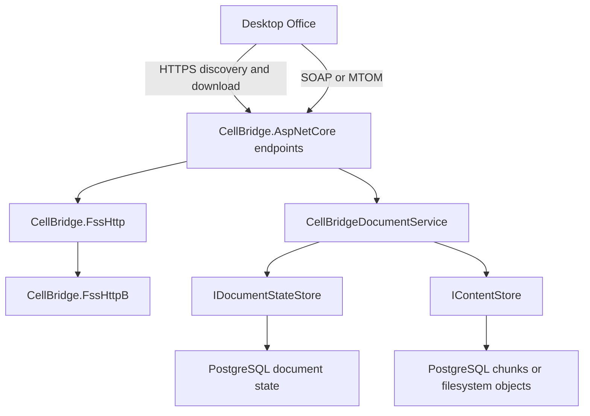

# Architecture

CellBridge implements the Office file synchronization protocols in reusable
.NET libraries. The sample host and demo provide a development environment;
[interoperability coverage](interoperability.md) describes the tested client
behavior and unsupported operations.

## Request flow

`/_vti_bin/cellstorage.svc` handles the outer MS-FSSHTTP envelope. Cell
subrequests carry MS-FSSHTTPB requests inline as base64 or in MTOM attachments.
The endpoint resolves document identity before dispatch and serializes each
operation's protocol response. HTTP 200 alone does not indicate save success.
See [protocol scope](protocol-version-decision.md).

Authentication runs before parsing. The sample supplies PostgreSQL Identity
accounts, MS-OFBA challenges and shared cookie protection keys. Each operation
checks the caller's stable subject against the resolved document's ownership
and grants. Sessions, leases and receipts retain their authenticated owner.
See [authentication and permissions](authentication.md).

## Libraries and executables

| Project | Responsibility |
| --- | --- |
| `CellBridge.FssHttp` | SOAP/MTOM parsing, response serialization and subrequest models |
| `CellBridge.FssHttpB` | Binary framing, manifests, graph data and synchronization messages |
| `CellBridge.Storage.Abstractions` | Immutable document records, state transitions and content handles |
| `CellBridge.Storage` | Detached protocol documents and persistence codecs |
| `CellBridge.Storage.PostgreSql` | Durable state, per-document coordination and chunked binary content |
| `CellBridge.Storage.FileSystem` | Immutable binary content with file and directory durability operations |
| `CellBridge.Storage.InMemory` | Volatile provider for development and tests |
| `CellBridge.Storage.Conformance` | Provider contract checks for consumers |
| `CellBridge.AspNetCore` | Save orchestration, discovery, download and cellstorage endpoints |
| `CellBridge.Web` | Sample host, package generation and catalog APIs |
| `CellBridge.Authentication` | Sample Identity account store, cookies, shared keys and login endpoints |
| `tools/CellBridge.Admin` | Operator account provisioning, explicit file imports and document permission updates |
| `tools/CellBridge.Storage.Setup` | Current-schema initialization and quiescent object maintenance |
| `demo/CellBridge.Demo` | Razor Pages client of the sample HTTP catalog |
| `aspire/apphost.cs` | PostgreSQL, schema initialization, sample host, demo and optional capture proxy |

The binary library is independent of ASP.NET Core and storage. Provider contracts
are independent of the protocols. The sample owns file creation and Aspire setup.

## Document identity and partitions

A document has a stable resource ID and a normalized path key. A supplied
resource ID takes precedence over a URL; an unknown ID returns an explicit
lookup failure. Lookup does not create a document or redirect to a matching path.

File contents, application metadata and the editors table have independent
partition identities, serials and synchronization knowledge. File saves merge
against the retained graph and reconstruct the Office package through
`PartitionGraphSnapshot`. Reconstruction follows graph references rather than
choosing an individual binary object by size.

## Save publication

Durable saves reconstruct the package into an exclusive temporary file and check
every ZIP member under the expanded-byte budget before storing immutable content.
The staging file is deleted on success, failure or cancellation. The synchronous
in-memory save API remains buffered. This work precedes the document's row lock.
It then reads the current state and database time, rechecks Write permission,
coherency and leases, and commits the selected revision with a save receipt.
Different documents can progress independently. Sessions use the same coordination.

Downloads take content and headers from one snapshot. Receipts identify duplicate
saves; shared budgets reject excessive growth before selecting a new revision.
Prior file parts remain available for subsequent edits and detached readers.

[Storage providers](storage-providers.md) explains publication, retries, maintenance
and provider contracts. The [protocol guide](protocol-version-decision.md#synchronization-knowledge)
explains changed-part selection, graph retention and materialization constraints.

MTOM responses stream one prepared message with matching capture bytes and exact
content length. Incoming requests and retained graph payloads still occupy memory.
See [response serialization](protocol-version-decision.md#response-serialization)
for buffer ownership and XML precedence.
