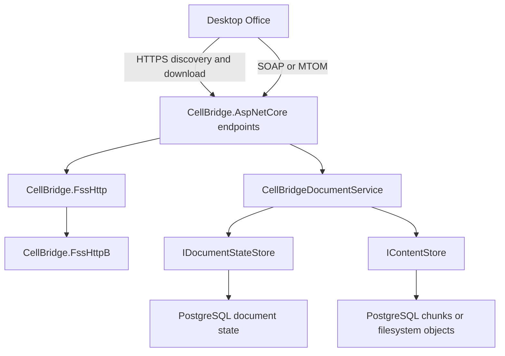

# Architecture

CellBridge implements the Office file synchronization protocols in reusable
.NET libraries. The sample host and demo provide a development environment;
[interoperability coverage](interoperability.md) describes the tested client
behavior and unsupported operations.

## Request flow

`/_vti_bin/cellstorage.svc` handles the outer MS-FSSHTTP envelope. Cell
subrequests carry MS-FSSHTTPB requests inline as base64 or in MTOM attachments.
The endpoint resolves document identity before dispatch and serializes each
operation's protocol response. HTTP 200 alone does not indicate save success.
See [protocol scope](protocol-version-decision.md).

Authentication runs before parsing. The sample supplies PostgreSQL Identity
accounts, MS-OFBA challenges and shared cookie protection keys. Each operation
checks the caller's stable subject against the resolved document's ownership
and grants. Sessions, leases and receipts retain their authenticated owner.
See [authentication and permissions](authentication.md).

## Libraries and executables

| Project | Responsibility |
| --- | --- |
| `CellBridge.FssHttp` | SOAP/MTOM parsing, response serialization and subrequest models |
| `CellBridge.FssHttpB` | Binary framing, manifests, graph data and synchronization messages |
| `CellBridge.Storage.Abstractions` | Immutable document records, state transitions and content handles |
| `CellBridge.Storage` | Detached protocol documents and persistence codecs |
| `CellBridge.Storage.PostgreSql` | Durable state, per-document coordination and chunked binary content |
| `CellBridge.Storage.FileSystem` | Immutable binary content with file and directory durability operations |
| `CellBridge.Storage.InMemory` | Volatile provider for development and tests |
| `CellBridge.Storage.Conformance` | Provider contract checks for consumers |
| `CellBridge.AspNetCore` | Save orchestration, discovery, download and cellstorage endpoints |
| `CellBridge.Web` | Sample host, package generation and catalog APIs |
| `CellBridge.Authentication` | Sample Identity account store, cookies, shared keys and login endpoints |
| `tools/CellBridge.Admin` | Operator account provisioning, explicit file imports and document permission updates |
| `tools/CellBridge.Storage.Setup` | Current-schema initialization and quiescent object maintenance |
| `demo/CellBridge.Demo` | Razor Pages client of the sample HTTP catalog |
| `aspire/apphost.cs` | PostgreSQL, schema initialization, sample host, demo and optional capture proxy |

The binary library has no ASP.NET Core or database dependency. Provider
contracts have no protocol dependency. The hosting library contains neither
sample package creation nor Aspire orchestration.

## Document identity and partitions

A document has a stable resource ID and a normalized path key. A supplied
resource ID takes precedence over a URL; an unknown ID returns an explicit
lookup failure. Lookup does not create a document or redirect to a matching path.

File contents, application metadata and the editors table have independent
partition identities, serials and synchronization knowledge. File saves merge
against the retained graph and materialize the Office package through
`PartitionGraphSnapshot`. Selecting the largest binary object cannot recover a
valid file partition.

The selected revision manifest must identify the revision named by the cell and
storage index. Materialization uses only that revision's explicitly referenced
object groups. General lookup through ancestor revisions is not implemented;
a missing object fails even if an unrelated retained revision contains it. A
self-contained graph can still materialize when its base revision is unavailable,
but retention analysis blocks compaction until those dependencies resolve.

Binary parsing uses bounded memory views for intermediate object bodies, while
snapshots and public parsed content own defensive copies of mutable input bytes.
Array materialization validates the graph and allocates one exact output buffer.
`MaterializeTo` and `MaterializeToAsync` write to non-seekable destinations and
leave them open. Both validate references, cycles, represented sizes and the byte
limit before writing; structural failures leave the destination untouched. I/O
failure or cancellation during writing can leave partial output. Callers of the
mutable `ObjectGroupGraph` must avoid changing it during materialization.

Data-element framing and diagnostic object parsing allow 33 nested stream objects.
PutChanges response framing applies the same nesting limit and checks lengths
before computing offsets. The binary writer copies spans directly into its owned
buffer; returned arrays remain independent copies.
Object graphs allow 256 objects on an active path and at most one million visits
per materialization, including repeated references. The traversal budget also
bounds zero-byte graphs that would otherwise expand without reaching a byte limit.
These checks complement the host's request and retained-state budgets.

## Save publication

Content preparation and immutable-object writes occur before the document
transaction. Durable saves verify the retained graph without reading the previous
complete package, materialize into an exclusively created temporary file, read
every ZIP member under the expanded-byte budget, then rewind for content storage.
The temporary file closes and is deleted on success, failure or cancellation.
The synchronous in-memory save API retains its buffered behavior. Publication takes the document's row lock, reads the current state
and authoritative database time, rechecks Write permission, graph coherency and lease ownership, and commits
one state snapshot with the accepted response receipt. Different documents can
progress independently. Session and lease changes use the same coordination.

Readers acquire one state snapshot for both content and headers. A concurrent
save cannot mix one revision's length or ETag with another revision's bytes.
Published objects remain available until quiescent collection over every retained
snapshot, allowing detached readers and later graph updates to reference prior
data. PostgreSQL bounds JSON history independently of content versions. A retry
resolves through its stored identity and digest rather than publishing a second
version. Shared accounting admits object bytes and metadata atomically; a quota
failure preserves the current revision.

File queries select unknown GUID/serial ranges from persisted metadata before
reading payloads. Foreign scopes and historical versions remain unsupported.
Automatic graph pruning is disabled until references and stale-client recovery
are qualified.

MTOM responses prepare SOAP with XOP references directly from binary model fields.
One prepared message supplies its exact content length and multipart framing to
both wire capture and HTTP streaming. Binary arrays remain borrowed until writing
finishes. Raw XML responses keep their XML precedence and are not decoded as
binary. Non-MTOM responses continue to inline base64.

Restoration, queries and save-receipt replay read at most the declared content
length plus one EOF probe, verify SHA-256, and reject conflicting handles that
share a cache key. Receipt replay also requires a complete successful binary save
response with no trailing bytes.

[Storage providers](storage-providers.md) documents the contracts, failure
behavior, migration, backup and retention requirements. Incoming HTTP messages and
retained graph payloads still occupy memory, and graph merging retains defensive
copies. Streamed durable packages and MTOM output reduce additional buffering;
these changes do not establish qualified Office file sizes.
